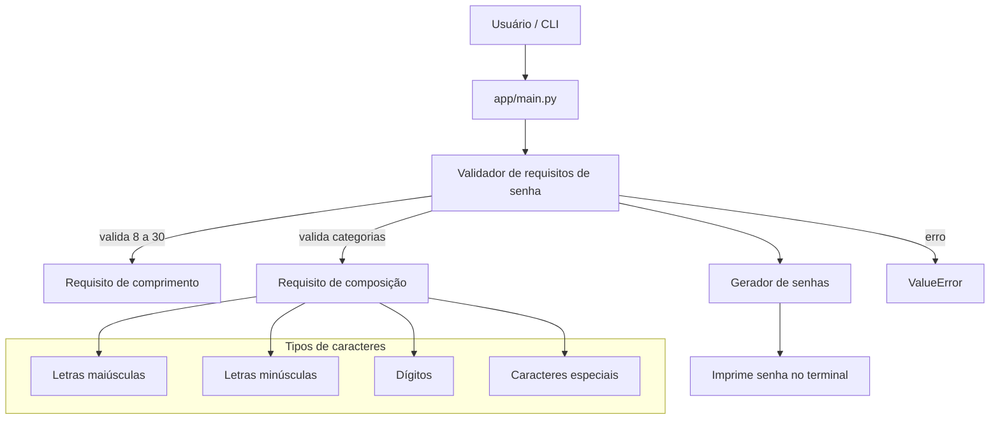

```mermaid
flowchart TD
    User[Usuário / CLI] --> Main[app/main.py]
    Main --> Validator[Validador de requisitos de senha]
    Validator -->|valida 8 a 30| LengthReq[Requisito de comprimento]
    Validator -->|valida categorias| CategoryReq[Requisito de composição]
    Validator --> Generator[Gerador de senhas]
    Generator --> Output[Imprime senha no terminal]
    Validator -->|erro| Error[ValueError]

    subgraph categories [Tipos de caracteres]
      Upper[Letras maiúsculas]
      Lower[Letras minúsculas]
      Digits[Dígitos]
      Punct[Caracteres especiais]
    end

    CategoryReq --> Upper
    CategoryReq --> Lower
    CategoryReq --> Digits
    CategoryReq --> Punct
```